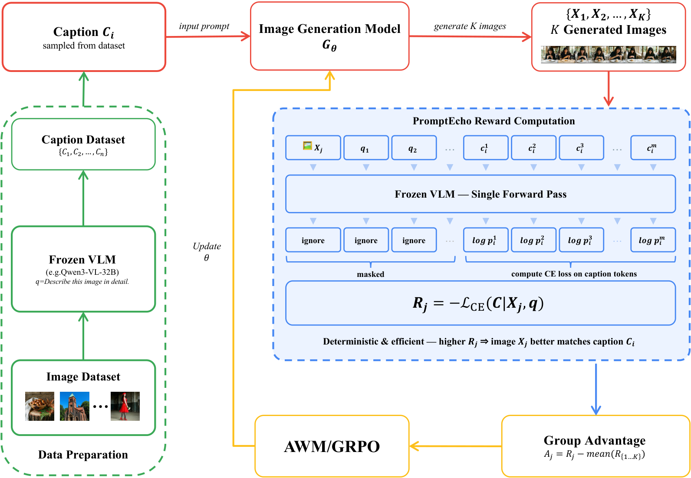

# PromptEcho

**Annotation-Free Reward from Vision-Language Models for Text-to-Image Reinforcement Learning**

[](https://arxiv.org/abs/2604.12652)
[](LICENSE)

## Overview

Current text-to-image RL methods typically rely on reward models trained on costly human preference annotations, which limits their scalability. **PromptEcho** eliminates this bottleneck by deriving reward signals directly from a frozen vision-language model (VLM) — no annotations needed.

The key idea: given a generated image and the original text prompt, PromptEcho feeds the image into a frozen VLM and computes the **negative cross-entropy loss** of re-generating the prompt caption conditioned on the image. A higher log-probability means the VLM "echoes" the prompt more faithfully, indicating better prompt-following. This scalar reward is deterministic, requires only a single forward pass, and plugs directly into GRPO/AWM-style policy optimization.

<p align="center">
  
</p>

**How it works:**
1. The image generation model $G_\theta$ produces $K$ images from a sampled caption $C_i$.
2. Each image $X_j$ is fed into a frozen VLM alongside a fixed query $q$ (e.g. *"Describe this image in detail."*). The VLM computes the log-probability of the caption tokens, yielding the reward $R_j = -\mathcal{L}_{\text{CE}}(C | X_j, q)$.
3. A group advantage $A_j = R_j - \text{mean}(R_{1..K})$ is computed and used to update $G_\theta$ via AWM/GRPO.

The result is a fully automated RL loop that consistently improves prompt-following without any human labeling.

### Qualitative Results

<p align="center">
  
</p>

Side-by-side comparisons on complex, detail-rich prompts from DenseAlignBench. The **Baseline** column shows images from the original model; **Ours** shows images after PromptEcho RL fine-tuning. PromptEcho-tuned models capture fine-grained prompt details more faithfully — such as specific text rendering, object counts, spatial relationships, and material attributes.

This repository contains:
- **DenseAlignBench** — a pairwise evaluation benchmark with 2,000 diverse captions and VLM-based judging
- **Inference scripts** for generating images with the fine-tuned models

**LoRA weights** are hosted on Hugging Face:
- Qwen-Image: [robotxx/prompt-echo-qwenimage](https://huggingface.co/robotxx/prompt-echo-qwenimage)
- Z-Image: [robotxx/prompt-echo-z-image](https://huggingface.co/robotxx/prompt-echo-z-image)

## Repository Structure

```
promptecho/
├── README.md                              # This file
├── requirements.txt                       # Python dependencies
├── metadata.jsonl                         # DenseAlignBench: 2,000 test captions
├── dense_align_bench/
│   ├── __init__.py
│   ├── evaluator.py                       # DenseAlignEvaluator (pairwise VLM judge)
│   ├── evaluate_pairwise.py               # Run pairwise evaluation across models
│   └── analyze_position_bias.py           # Analyze & visualize position bias
└── inference/
    ├── infer_qwenimage.py                 # Qwen-Image inference (single/multi-GPU)
    └── infer_z_image.py                   # Z-Image inference (single/multi-GPU)
```

## Quick Start

### Installation

```bash
git clone https://github.com/roooobotx/prompt_echo.git
cd prompt_echo
pip install -r requirements.txt
```

### Image Generation

#### Qwen-Image with PromptEcho LoRA

Download LoRA weights from [Hugging Face](https://huggingface.co/robotxx/prompt-echo-qwenimage):

```bash
# Single GPU
python inference/infer_qwenimage.py \
    --base_model_path Qwen/Qwen-Image-2512 \
    --lora_path robotxx/prompt-echo-qwenimage \
    --caption_jsonl ./metadata.jsonl \
    --output_dir ./output_qwenimage

# Multi-GPU (8x)
accelerate launch --num_processes 8 inference/infer_qwenimage.py \
    --base_model_path Qwen/Qwen-Image-2512 \
    --lora_path robotxx/prompt-echo-qwenimage \
    --caption_jsonl ./metadata.jsonl \
    --output_dir ./output_qwenimage

# Base model only (no LoRA)
python inference/infer_qwenimage.py \
    --base_model_path Qwen/Qwen-Image-2512 \
    --caption_jsonl ./metadata.jsonl \
    --output_dir ./output_qwenimage_base
```

#### Z-Image with PromptEcho LoRA

Download LoRA weights from [Hugging Face](https://huggingface.co/robotxx/prompt-echo-z-image):

```bash
# Single GPU
python inference/infer_z_image.py \
    --base_model_path Tongyi-MAI/Z-Image \
    --lora_path robotxx/prompt-echo-z-image \
    --caption_jsonl ./metadata.jsonl \
    --output_dir ./output_z_image

# Multi-GPU (8x)
accelerate launch --num_processes 8 inference/infer_z_image.py \
    --base_model_path Tongyi-MAI/Z-Image \
    --lora_path robotxx/prompt-echo-z-image \
    --caption_jsonl ./metadata.jsonl \
    --output_dir ./output_z_image
```

## DenseAlignBench Evaluation

DenseAlignBench uses a VLM judge (default: Google Gemini) to perform pairwise comparison of images from different models, focusing on **prompt-following accuracy**. It includes random image-order shuffling to mitigate position bias.

### Setup

Set your API key as an environment variable:

```bash
# For Google Gemini (default)
export GEMINI_API_KEY="your-gemini-api-key"

# Or for other OpenAI-compatible endpoints
export OPENAI_API_KEY="your-api-key"
```

### Run Pairwise Evaluation

The evaluation expects each model's outputs in a subdirectory containing `metadata.jsonl` and the generated images:

```
inference_results/
├── model_a/
│   ├── metadata.jsonl    # Must have "caption", "filename", and "data_id" or "index" fields
│   ├── 0000.png
│   └── ...
└── model_b/
    ├── metadata.jsonl
    ├── 0000.png
    └── ...
```

Run the evaluation:

```bash
python -m dense_align_bench.evaluate_pairwise \
    --input_dir ./inference_results \
    --output_dir ./eval_results \
    --model_pairs "all" \
    --num_workers 16

# With a specific model and API endpoint
python -m dense_align_bench.evaluate_pairwise \
    --input_dir ./inference_results \
    --output_dir ./eval_results \
    --model "gemini-2.5-flash-preview" \
    --base_url "https://generativelanguage.googleapis.com/v1beta/openai/" \
    --num_workers 8

# Resume a previous run
python -m dense_align_bench.evaluate_pairwise \
    --input_dir ./inference_results \
    --output_dir ./eval_results \
    --skip_existing
```

### Analyze Position Bias

After running pairwise evaluation, analyze whether position bias was successfully mitigated:

```bash
python -m dense_align_bench.analyze_position_bias \
    --input_dir ./eval_results \
    --output_dir ./bias_analysis
```

This produces:
- Per-pair bar charts comparing shuffled vs. non-shuffled win rates
- A chi-square statistical test for each pair
- A markdown report summarizing all results

### Input Format

Each model directory must contain a `metadata.jsonl` file with one JSON object per line:

```json
{"data_id": "0001", "caption": "A red cat sitting on a blue chair", "filename": "0001.png"}
```

Required fields:
- `caption` — the text prompt used to generate the image
- `filename` — path to the generated image (relative to the model directory)
- `data_id` or `index` — unique sample identifier

## Model Details

| Model | Base Model | LoRA Rank | LoRA Alpha | HuggingFace |
|-------|-----------|-----------|------------|-------------|
| Qwen-Image + PromptEcho | `Qwen/Qwen-Image-2512` | 64 | 128 | [robotxx/prompt-echo-qwenimage](https://huggingface.co/robotxx/prompt-echo-qwenimage) |
| Z-Image + PromptEcho | `Tongyi-MAI/Z-Image` | 64 | 128 | [robotxx/prompt-echo-z-image](https://huggingface.co/robotxx/prompt-echo-z-image) |

## Results

**No benchmark-specific training was performed.** All improvements reflect genuine generalization of prompt-following ability.

### DenseAlignBench

| Comparison | Win Rate | Baseline Win Rate | Tie Rate | Net Advantage |
|---|---|---|---|---|
| Z-Image + PromptEcho vs Baseline | **61.5%** | 34.7% | 3.8% | **+26.8pp** |
| QwenImage + PromptEcho vs Baseline | **53.3%** | 37.0% | 9.7% | **+16.2pp** |

### GenEval

| Model | Single Obj. | Two Obj. | Counting | Colors | Position | Attr. Bind. | Overall |
|---|---|---|---|---|---|---|---|
| Z-Image (Baseline) | 0.99 | 0.91 | 0.75 | 0.86 | 0.41 | 0.59 | 0.75 |
| **+ PromptEcho** | **1.00** | **0.94** | **0.85** | 0.86 | **0.52** | **0.73** | **0.82 (+6.5pp)** |
| QwenImage-2512 (Baseline) | 0.99 | **0.94** | 0.56 | 0.87 | 0.47 | 0.64 | 0.74 |
| **+ PromptEcho** | 0.99 | 0.93 | **0.68** | **0.90** | **0.55** | **0.70** | **0.79 (+5pp)** |

### DPG-Bench

| Model | Global | Entity | Attribute | Relation | Other | Overall |
|---|---|---|---|---|---|---|
| Z-Image (Baseline) | 91.60 | 91.54 | 90.32 | 92.76 | **91.94** | 86.90 |
| **+ PromptEcho** | **93.05** | **92.76** | **91.87** | **93.89** | 89.99 | **87.92 (+1.02)** |
| QwenImage-2512 (Baseline) | **94.40** | **93.27** | 90.01 | 92.82 | 91.34 | 87.32 |
| **+ PromptEcho** | 91.21 | 93.25 | **90.39** | **93.63** | **93.13** | **87.49** |

### TIIFBench

| Model | Overall (short) | Overall (long) |
|---|---|---|
| Z-Image (Baseline) | 84.91 | 83.16 |
| **+ PromptEcho** | **88.50 (+3.6pp)** | **88.94 (+5.8pp)** |
| QwenImage-2512 (Baseline) | 84.89 | 83.25 |
| **+ PromptEcho** | **85.50** | **86.46 (+3.2pp)** |

See the [paper](https://arxiv.org/abs/2604.12652) for detailed analysis, ablation studies, and qualitative comparisons.

## Citation

If you find this work useful, please cite:

```bibtex
@article{promptecho2026,
  title={PromptEcho: Annotation-Free Reward from Vision-Language Models for Text-to-Image Reinforcement Learning},
  author={PromptEcho Team},
  journal={arXiv preprint arXiv:2604.12652},
  year={2026}
}
```

## License

This project is licensed under the Apache License 2.0.
